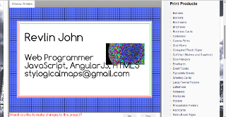

{{$developer}}
======

...codes professionally and personally for the World Wide Web and its associated technologies. His skills range from scripting simple utilities to crafting fully scalable applications to spec, appropriate to a variety of client/server configurations. The toolbox from which he regularly pulls includes JavaScript, HTML5, SVG, Perl, audio and video streaming.

What follows is an incomplete listing of his works:

### Maponics 
[www.maponics.com](https://reveal.maponics.com/tutorial/)

### PixOasis 
[beta.pixoasis.com](https://beta.pixoasis.com/)

### MingShine 
[mingshine.com](http://mingshine.com/new_car_protection.html)

### Vanprint 
[www.vanprint.com](http://www.vanprint.com/store/shop/business-card-custom/)

### JavaScript Demos
[www.uni-sol.org/js-demos](http://uni-sol.org/js-demos)

### SVG (+Perl) Demos
[www.uni-sol.org/svg-demos](http://uni-sol.org/svg-demos)
