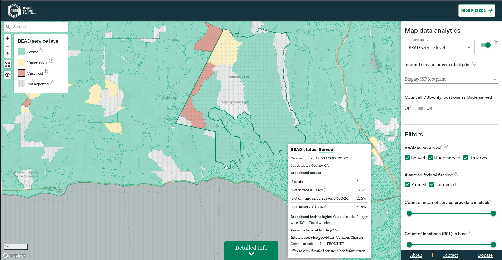
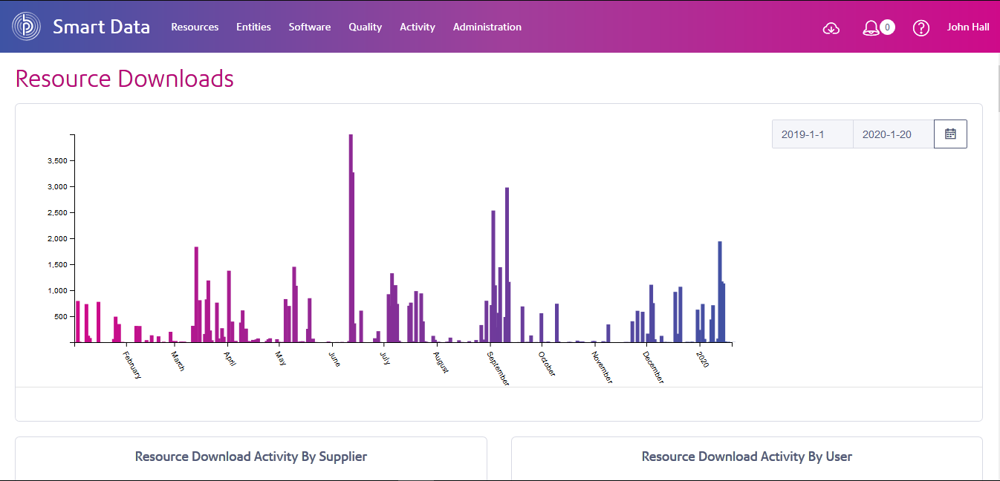
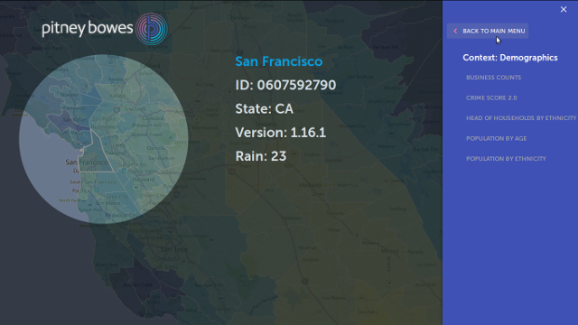
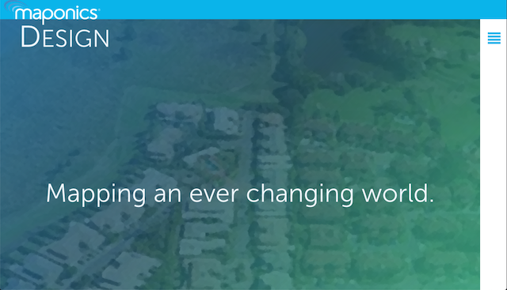
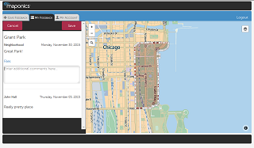
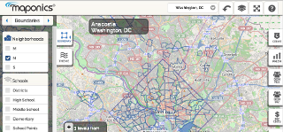
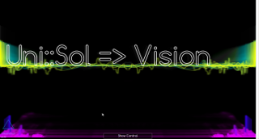

…codes professionally and personally for the World Wide Web and its
associated technologies. His skills range from scripting simple
utilities to crafting fully scalable applications to spec. The toolbox
from which he regularly pulls includes JavaScript, Kotlin, NodeJS, R,
SQL, SVG, TypeScript, WebGL, audio and video streaming, as well as
various cloud-native platforms, including AWS, Docker, Elasticsearch,
Redis and Spring.

Lately, he focuses on different ways to process and prepare data. 
[Return to the homepage to learn more and read the latest posts on these
topics](../..).

## Professional skills/attributes:

- A passion for solving problems and providing workable solutions.
- Ability to anticipate, respond, and adapt quickly to changing
  requirements and competing demands.
- Ability to visualize processes and outcomes
- Ability to update and manage GitHub repositories
- Ability to build and maintain RESTful APIs and backend services.
- Professional interpersonal and communication skills
- Collaborative problem solver and trouble shooter.
- Demonstrated success interpreting business needs, translating, and
  implementing them into executable specifications and products.
- Proficiency in troubleshooting software issues and debugging a large
  codebase.
- Clear understanding of the DevOps technology stack, including Linux,
  Docker, Git, etc.
- Familiarity with agile development methodologies and version control
  systems.
- Proficiency in React, HTML5, Javascript, Typescript, CSS3/SASS,
  GraphQL, and other web-oriented technologies.
- Solid knowledge of Python, R and SQL
- Strong analytical and reasoning skills
- Strong attention to detail and accuracy

#### What follows is a brief synopsis of his work:[\*](#details)

## Center On Rural Innovation /  Rural Innovation Strategies, Inc.

The foresight and vision of CORI resonates deeply with me and I was
especially attracted to the opportunity to build applications, tools and
visualizations that could reshape our narratives about where ingenuity
and innovation can happen. At CORI, I contributed to work that was aimed
at creating a bridge between the tech economies of rural regions and
those of major urban centers, where the vast majority of tech innovation
and growth has occurred over the last three decades. My role enabled me
to utilize the web as a platform for delivering high-quality, highly
interactive data experiences by guiding my team in the selection and
mastery of new software tools and frameworks, including but not limited
to:

AWS • Docker • PostgreSQL/PostGIS • Python • React • R • Shiny •
TypeScript • Vite

### Rural Broadband Map

[rural-broadband-map.ruralinnovation.us](https://rural-broadband-map.ruralinnovation.us/?geoid=060379800191000,060379800191001,060379800191002,060379800191003,060379800191004,060379800191005,060379800191006,060379800191007,060379800191008,060379800191009,060379800191010,060379800191011,060379800191012,060379800191013,060379800191014,060379800191015,060379800191016,060379800191017,060379800191018,060379800191019,060379800191020,060379800191021,060379800191022)

- Designed and implemented the
  <a href="https://cori-data-api.ruralinnovation.us/" class="external"
  target="_blank">CORI Data API</a> backend (including GraphQL, Rest,
  and S3 resources)
  - Provides an assortment of broadband metrics and demographic data at
    multiple geographic levels (county, tract, block, etc.)
  - Built with AWS Lambda and RDS (PostgreSQL)
  - Continuously deploys from code commits using AWS CDK
- Built map-based frontend that incorporates a mix of backend data
  sources, including CORI Data API and Mapbox (styles and tile sets)
- Administrated periodic data updates to both the backend(s) and
  frontend

Copyright © Center on Rural Innovation / Rural Innovation Strategies,
Inc. 2025

 

## Precisely /  Pitney Bowes 

### Smart Data Platform

[smartdata.precisely.com](https://smartdata.precisely.com)

- Created web-based interfaces (both graphical and restful) for the
  Smart Data Platform (SDP) internal web portal.
- Created tools to provide useful and accurate views on data resource
  usage, various product build life-cycles and the quality of results
- Completed integrations between the internal platform and data
  retrieval API’s provided by external suppliers, facilitating the
  implementation of end-to-end automation of the data update cycle.

Copyright © Precisely/Pitney Bowes Software & Data 2020

 

## Pitney Bowes /  Maponics 

### Horizon (*Visualization* in Precisely Data Experience)

[horizon.maponics.com](https://data.precisely.com/visualization/map-explorer/data?zoom=10&latitude=42.37985076434416&longitude=-71.24771118164064&baseMap=Light&activeLayer=pb_NeighborhoodBoundaries_Neighborhoods&layers=pb_NeighborhoodBoundaries_Neighborhoods)

- Created graphical, interactive application allowing interaction and
  search on a full spectrum GIS boundary & centroid data product
- Front-end utilized MVC, mobile and map-based frameworks (AngularJS,
  Leaflet, MapBox, Material Design)
- Back-end implemented in Node.js and allowed complete integration with
  our REST API’s, providing location, mapping and analytic services

### MX Design (Horizon Template)

[maponics-design](libs/maponics-design/mx-index.html)

- Designed and implemented the component-based Maponics Design
  (mx-design) template in AngularJS
- Wrote technical paper advising for the creation of a re-usable [Web
  GUI
  template](https://docs.google.com/document/d/1Qa4i7o0Wknp0jDB1J26-sAnvvFaccz4E2esRXB8a1U0/edit?usp=sharing)

        
           

Copyright © Maponcis 2016, © Pitney Bowes 2017

 

## Maponics 

### Feedback App

[feedback.maponics.com](http://feedback.maponics.com/)

- Created graphical, interactive application allowing existing customers
  to provide feedback
- App managed the flow of user-generated feedback, specific to a given
  GIS boundary/data product
- Front-end utilized MVC, mobile and map-based frameworks (AngularJS,
  Leaflet, MapBox)
- Back-end implemented in Node.js to access PostgreSQL database

Copyright © Maponics 2015

 

## Maponics 

### Reveal Demo

[reveal.maponics.com](https://reveal.maponics.com/)

- Created graphical, interactive demo of various GIS-based data products
- Front-end utilized MVC, mobile and map-based frameworks/APIs (jQuery
  Mobile, Giscloud)
- Back-end implemented in Perl to access PostgreSQL database, allowing
  integration with the analytic and demographic data specific to each
  product

Copyright © Maponics 2013

 

## PixOasis 

### [www.pixoasis.com](https://www.pixoasis.com/)

- Implemented conversion of site and integrated services to new design
- Received new design in the form of layered PSD files
- Retained or re-implemented all of the functionality of the previous
  site (offering photo delivery and archival services)
- Completely responsible for programming and testing this site, ensuring
  cross-browser compatibility

Copyright © PixOasis 2013

 

## JS Demos 

### [js-demos](js-demos/index.html)

 

<video id="aud1" poster="images/fathers.jpg" preload="auto" muted="true" controls="true">

<source src="video/fathers.mp4" />

<source src="video/fathers.ogv" />

</video>

 

<!--

&ast; _Please contact John for details and demos_: [john@real-currents.com](mailto:john@real-currents.com)

-->

<!--script type="text/javascript" id="cvSrc" src="js-demos/scripts/interact-grid.js"></script-->
