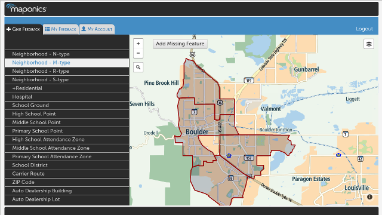

John Hall
======

...codes professionally and personally for the World Wide Web and its associated technologies. His skills range from scripting simple utilities to crafting fully scalable applications to spec, appropriate to a variety of client/server configurations. The toolbox from which he regularly pulls includes JavaScript, HTML5, SVG, Perl, audio and video streaming.

In addition to his professional activities, John contributes code to the Open Source community on GitHub [(github.com/dancingfrog)](https://github.com/dancingfrog) and occassionaly masquerades as Revlin John, his eclectic alter-ego [(github.com/revlin)](https://github.com/revlin). What follows is a brief synopsis of his works &ast;:

### Pitney Bowes 
#### Horizon App | [horizon.maponics.com](https://horizon.maponics.com/)
* Created graphical, interactive application allowing interaction and search on a full spectrum GIS boundary & centroid data products
* Front-end utilized MVC, mobile and map-based frameworks (AngularJS, Leaflet, MapBox, Material Design)
* Back-end implemented in Node.js and allowed complete integration with our REST API's, providing location, mapping and analytic services

Copyright © Pitney Bowes 2016

### Maponics 
#### Feedback App | [feedback.maponics.com](http://feedback.maponics.com/)
* Created graphical, interactive application allowing existing customers to provide feedback
* App managed the flow of user-generated feedback, specific to a given GIS boundary/data product
* Front-end utilized MVC, mobile and map-based frameworks (AngularJS, Leaflet, MapBox)
* Back-end implemented in Node.js to access PostgreSQL database

Copyright © Maponics 2015

### Maponics 
#### Reveal Demo | [reveal.maponics.com](https://reveal.maponics.com/)
* Created graphical, interactive demo of various GIS-based data products
* Front-end utilized MVC, mobile and map-based frameworks/APIs (jQuery Mobile, Giscloud)
* Back-end implemented in Perl to access PostgreSQL database, allowing integration with the analytic and demographic data specific to each product

Copyright © Maponics 2013

### PixOasis 
#### [www.pixoasis.com](https://www.pixoasis.com/)
* Implemented conversion of site and integrated services to new design
* Received new design in the form of layered PSD files
* Retained or re-implemented all of the functionality of the previous site (offering photo delivery and archival services)
* Completely responsible for programming and testing this site, ensuring cross-browser compatibility

Copyright © PixOasis 2013

### Tangible 
#### [tangiblecorp.herokuapp.com](/tangible.html)
* Converted site theme to AngularJS controllers and templates
* Integrated UI Bootstrap module with Carousel (slides) and Modals
* Received design updates in the form of layered PSD files

### Vanprint 
#### [www.vanprint.com](http://www.vanprint.com/store/shop/business-card-custom)
* Created back-end for web-to-print app, allowing users to upload images and enter text which is compiled into a final pdf document
* Back-end consisted of collection of Perl modules used to receive and process the user content into a printable PDF document and store data in MySQL
* Utilized SVG to create templates for various document styles (i.e. business cards, letter heads, etc.)

### JS Demos 
#### [js-demos](/js-demos)

<h1 id="text_title"></h1>

  <video id="aud1" preload="auto" muted ="true" controls="true">
    <source src="https://s3-us-west-1.amazonaws.com/real-currents/js-demos/video/fathers.mp4" />
    <source src="https://s3-us-west-1.amazonaws.com/real-currents/js-demos/video/fathers.ogv" />
  </video>

	 
	<em>These demos by <a href="mailto:john@real-currents.com">John</a> are licensed under the <a href="http://creativecommons.org/licenses/by-sa/3.0/nz/deed.en_GB">Creative Commons Attribution-ShareAlike 3.0 License, 2009-2016</a></em>

