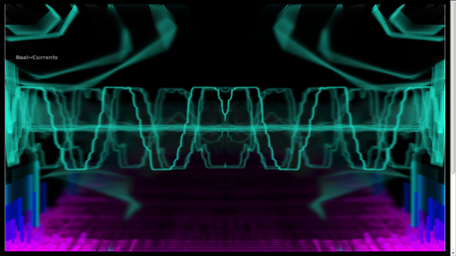

John Hall
======

...codes professionally and personally for the World Wide Web and its associated technologies. His skills range from scripting simple utilities to crafting fully scalable applications to spec, appropriate to a variety of client/server configurations. The toolbox from which he regularly pulls includes Java, Kotlin, NodeJS, R, SQL, SVG, TypeScript, WebGL, audio and video streaming, as well as various cloud-native platforms, including AWS, Docker, Elasticsearch, Redis and Spring.

What follows is a brief synopsis of his works [&ast;](#details):

### Pitney Bowes 
#### Smart Data Platform | [smartdata.pb.com](https://smartdata.pb.com)
As a key member of the development team, John created web-based interfaces (both graphical and restful) for the Smart Data Platform (SDP) internal web portal.
* Created tools to provide useful and accurate views on data resource usage, various product build life-cycles and the quality of results
* Completed integrations between the internal platform and data retrieval API’s provided by external suppliers, facilitating the implementation of end-to-end automation of the data update cycle.
* Expected to communicate at a high-level with various stakeholders and participants in SDP’s build processes in order to overhaul and improve the product builds and deliver the results  to market

### Maponics /  Pitney Bowes 
#### Horizon (*Visualization* in Software & Data Marketplace) | [horizon.maponics.com](https://pbs-access.pitneybowes.com/#!/home%2Fvisualise?v=10,-122.41942,37.77493)
* Horizon (Original App) | [sandbox.maponics.com](https://sandbox.maponics.com)
* Created graphical, interactive application allowing interaction and search on a full spectrum GIS boundary & centroid data product
* Front-end utilized MVC, mobile and map-based frameworks (AngularJS, Leaflet, MapBox, Material Design)
* Back-end implemented in Node.js and allowed complete integration with our REST API's, providing location, mapping and analytic services

#### MX Design (Horizon Template) | [maponics-design](libs/maponics-design/mx-index.html)
* Designed and implemented the component-based Maponics Design (mx-design) template in AngularJS
* Wrote technical paper advising for the creation of a re-usable [Web GUI template](https://docs.google.com/document/d/1Qa4i7o0Wknp0jDB1J26-sAnvvFaccz4E2esRXB8a1U0/edit?usp=sharing)

 

Copyright © Maponcis 2016, © Pitney Bowes 2017

### Maponics 
#### Feedback App | [feedback.maponics.com](http://feedback.maponics.com/)
* Created graphical, interactive application allowing existing customers to provide feedback 
* App managed the flow of user-generated feedback, specific to a given GIS boundary/data product
* Front-end utilized MVC, mobile and map-based frameworks (AngularJS, Leaflet, MapBox)
* Back-end implemented in Node.js to access PostgreSQL database

Copyright © Maponics 2015

### Maponics 
#### Reveal Demo | [reveal.maponics.com](https://reveal.maponics.com/)
* Created graphical, interactive demo of various GIS-based data products
* Front-end utilized MVC, mobile and map-based frameworks/APIs (jQuery Mobile, Giscloud)
* Back-end implemented in Perl to access PostgreSQL database, allowing integration with the analytic and demographic data specific to each product

Copyright © Maponics 2013

### PixOasis 
#### [www.pixoasis.com](https://www.pixoasis.com/)
* Implemented conversion of site and integrated services to new design
* Received new design in the form of layered PSD files
* Retained or re-implemented all of the functionality of the previous site (offering photo delivery and archival services)
* Completely responsible for programming and testing this site, ensuring cross-browser compatibility

Copyright © PixOasis 2013

### Tangible 
#### [tangiblecorp.herokuapp.com](/tangible.html)
* Converted site theme to AngularJS controllers and templates
* Integrated UI Bootstrap module with Carousel (slides) and Modals
* Received design updates in the form of layered PSD files

### JS Demos 
#### [js-demos](/js-demos/README.html)

<video id="aud1" poster="/js-demos/images/fathers.jpg" preload="auto" muted="true" controls="true">
<source src="/js-demos/video/fathers.mp4" />
<source src="/js-demos/video/fathers.ogv" />
</video>

 
<em>These demos by <a href="mailto:john@real-currents.com">John</a> are licensed under the <a href="http://creativecommons.org/licenses/by-sa/3.0/nz/deed.en_GB">Creative Commons Attribution-ShareAlike 3.0 License, 2009-2012 </a></em>

&ast; *Please contact John for demos and details: [john@real-currents.com](mailto:john@real-currents.com)*
